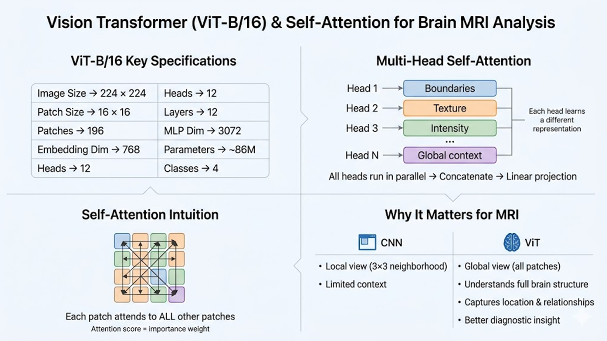
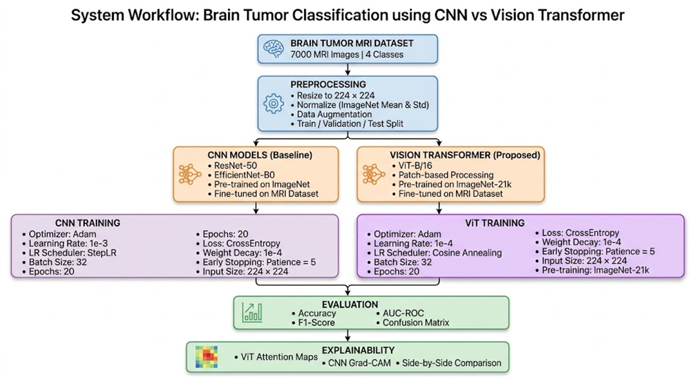

<div align="center">

# 🧠 Brain Tumor MRI Classifier

### Vision Transformers vs CNNs in Medical Imaging — A Systematic Comparison

[](https://www.python.org/)
[](https://pytorch.org/)
[](https://streamlit.io/)
[](https://huggingface.co/)
[](LICENSE)
[](https://www.kaggle.com/)

<br/>
</div>

---

## 🔭 Overview

This project implements a **4-class brain tumor classification system** from MRI scans, comparing a **Vision Transformer (ViT-B/16)** against two CNN baselines — **ResNet-50** and **EfficientNet-B0**. All three models are fine-tuned on the Brain Tumor MRI Dataset using transfer learning, evaluated on standard clinical metrics, and deployed through an interactive Streamlit web application with model explainability visualizations (GradCAM and ViT Attention Maps).

The central research question is: **Can Vision Transformers outperform CNNs in brain tumor classification, and can their attention mechanism serve as a clinically interpretable diagnostic tool?**

---

## 💡 Motivation

Brain tumors affect over **300,000 people globally each year**, making early and accurate diagnosis critical for treatment outcomes and survival rates. While MRI is the gold standard for brain imaging, manual interpretation by radiologists is time-consuming, subjective, and prone to error — particularly under high workload conditions.

**Key limitations of existing CNN-based approaches:**

- **Limited receptive field** — small filters (e.g. 3×3) restrict understanding to local features, missing global spatial context
- **Fixed filters** — cannot dynamically adapt to variations in tumor shape, size, or scan intensity
- **Weak long-range dependency modelling** — requires many stacked layers to approximate global context, often imperfectly
- **Noise sensitivity** — susceptible to MRI artifacts, motion blur, and intensity variations
- **Low interpretability** — GradCAM is a post-hoc approximation, not intrinsically built into the model

Vision Transformers address these gaps by treating the image as a sequence of patches and learning global attention across the entire scan in every layer.

---

## 🏗 Architecture

### Vision Transformer (ViT-B/16)

Introduced in ["An Image is Worth 16×16 Words"](https://arxiv.org/abs/2010.11929) (Dosovitskiy et al., 2020), ViT applies the Transformer architecture — originally designed for NLP — directly to image patches.

**ViT-B/16 Architecture:**


**Key advantages over CNNs:**
- Every patch attends to every other patch — captures global spatial context from layer 1
- Attention weights are input-dependent, adapting dynamically to each scan
- Uniform architecture across all layers — no handcrafted feature hierarchy
- Attention rollout from the `[CLS]` token directly produces diagnostic heatmaps

#### 🧠 Multi-Head Self-Attention (MHSA)
While single-head attention learns one relationship pattern, **Multi-Head Self-Attention** allows the model to simultaneously attend to information from different representation subspaces at different positions.



- **Intuitive Explanation (Search-and-Retrieve)**:
  Think of the attention mechanism as a database retrieval system where every patch interacts with every other patch:
  - **Query ($Q$)**: Represents "What am I looking for?" (e.g., *Is there a tumor boundary here?*).
  - **Key ($K$)**: Represents "What information do I contain?" (e.g., *I contain high-intensity edge features*).
  - **Value ($V$)**: Represents "What information should I pass on?" (the actual pixel/feature data).
  
  By computing the dot product $QK^T$, the model determines the compatibility between a Query and a Key. If they match, the corresponding **Value** is emphasized, allowing the model to "attend" to relevant distant features.

- **Parallel Processing**: In our ViT-B/16 model, we use **12 attention heads**. Each head operates in parallel, allowing the model to focus on various features:
  - *Heads 1-4*: Typically capture local features like tumor boundaries and sharp edges.
  - *Heads 5-8*: Often learn global spatial context, such as the overall symmetry of the brain.
  - *Heads 9-12*: Focus on complex relational features and subtle intensity variations in MRI signals.
- **The Mathematical Mechanism**:
  
  Let $X \in \mathbb{R}^{N \times D}$ be the matrix of input patch embeddings, where $N=196$ is the number of patches and $D=768$ is the embedding dimension.

  1. **Linear Projection**: For each head $i \in \{1, \dots, 12\}$, the input $X$ is projected into Queries ($Q_i$), Keys ($K_i$), and Values ($V_i$) using learnable weight matrices $W_i^Q, W_i^K, W_i^V \in \mathbb{R}^{D \times d_k}$:
     $$Q_i = XW_i^Q, \quad K_i = XW_i^K, \quad V_i = XW_i^V$$
     In our model, $d_k = D/h = 768/12 = 64$.

  2. **Scaled Dot-Product Attention**: For each head, the attention is computed by measuring the compatibility of Queries and Keys:
     $$\text{Attention}(Q_i, K_i, V_i) = \text{Softmax}\left(\frac{Q_i K_i^T}{\sqrt{d_k}}\right) V_i$$
     - $Q_i K_i^T$: Represents the raw attention scores (similarity) between all patches.
     - $\sqrt{d_k}$: A scaling factor to prevent the dot product from reaching regions of the Softmax function where gradients are extremely small.
     - $\text{Softmax}$: Normalizes the scores into a probability distribution (summing to 1).

  3. **Multi-Head Concatenation**: The outputs of all 12 heads are concatenated and projected back to the original dimension $D$ using an output projection matrix $W^O \in \mathbb{R}^{D \times D}$:
     $$\text{MultiHead}(Q, K, V) = \text{Concat}(\text{head}_1, \dots, \text{head}_{12}) W^O$$
- **Why it matters for MRI**: Medical diagnosis is multi-faceted. A tumor's classification depends on its size, texture, and position relative to brain structures. MHSA ensures the model doesn't over-fixate on a single visual cue, providing a more robust diagnostic representation.

---

## 🤖 Models

| Model | Architecture | Parameters | Pretrained On | LR Used |
|-------|-------------|------------|---------------|---------|
| **ResNet-50** | 50-layer residual CNN with skip connections | ~25M | ImageNet-1K | 1e-3 |
| **EfficientNet-B0** | Compound-scaled CNN (depth + width + resolution) | ~5.3M | ImageNet-1K | 1e-3 |
| **ViT-B/16** | 12-layer Vision Transformer, 16×16 patches | ~86M | ImageNet-21K | 1e-4 |

All classification heads were replaced with a `Dropout(0.4) → Linear(→ 4)` layer and fine-tuned end-to-end.

---

## 🔄 System Workflow (Deep Dive)

The project follows a unified pipeline for all three models (ResNet-50, EfficientNet-B0, and ViT-B/16), ensuring a fair comparison across different architectures.



### 1. Data Acquisition & Preprocessing
- **Input**: Raw MRI scans (JPG) from 4 diagnostic classes.
- **Standardization**: Images are resized to **224×224** pixels. Pixel values are normalized using the ImageNet dataset's mean and standard deviation $(\mu=[0.485, 0.456, 0.406], \sigma=[0.229, 0.224, 0.225])$ to match the pretrained model weights.
- **Augmentation Strategy**: To prevent overfitting on the 7,200 images, we apply random horizontal flips, rotations (±10°), and color jittering during the training phase only.

### 2. Model Architecture Selection
- **CNN Branch**:
  - **ResNet-50**: Uses residual blocks to overcome vanishing gradients, focusing on hierarchical spatial features.
  - **EfficientNet-B0**: Uses compound scaling to optimize depth, width, and resolution with minimal parameters (~5.3M).
- **ViT Branch**:
  - **ViT-B/16**: Treats the image as a sequence of 196 patches (16x16 pixels). It adds a learnable `[CLS]` token and positional embeddings to preserve spatial order.

### 3. Training & Optimization
- **Loss Function**: We use **Cross-Entropy Loss**, which is ideal for multi-class classification by penalizing the distance between predicted probabilities and true labels.
- **Optimizer**: **Adam** optimizer with a weight decay of $1e-4$ for regularization.
- **LR Scheduling**: A **Cosine Annealing** scheduler is used to smoothly decay the learning rate over 20 epochs, helping the model converge to a sharper global minimum.

### 4. Classification & Post-Processing
- The feature vectors from the models (Global Average Pooling for CNNs or `[CLS]` for ViT) are passed through a custom head: `Linear(Dropout(0.4)) → Linear(4 Classes)`.
- **Softmax** is applied at the final layer to convert raw logits into interpretable confidence percentages.

### 5. Diagnostic Explainability (XAI)
To build clinical trust, the workflow generates visual justifications:
- **CNNs**: GradCAM computes gradients of the target class with respect to the last convolutional layer to highlight important regions.
- **ViT**: Attention Rollout averages attention across heads in the final transformer layer, highlighting the specific patches the model "looked at" to make its prediction.

---

## 📊 Dataset

**Source:** [Brain Tumor MRI Dataset](https://www.kaggle.com/datasets/masoudnickparvar/brain-tumor-mri-dataset) by Masoud Nickparvar on Kaggle

| Property | Value |
|----------|-------|
| Total Images | 7,200 |
| Format | JPG |
| Input Resolution | 224 × 224 px |
| Classes | 4 (Glioma, Meningioma, Pituitary tumor, No tumor)|

### Class Distribution

| Class | Description | Train Split | Test Split |
|-------|-------------|:-----------:|:----------:|
| **Glioma** | Malignant tumor in brain / spinal cord | 1,400 | 400 |
| **Meningioma** | Tumor in brain / spinal cord membranes | 1,400 | 400 |
| **No Tumor** | Healthy scan | 1,400 | 400 |
| **Pituitary** | Tumor in the pituitary gland | 1,400 | 400 |

### Data Augmentation

| Augmentation | Train | Validation / Test |
|---|:---:|:---:|
| Resize to 224×224 | ✅ | ✅ |
| Random Horizontal Flip (p=0.5) | ✅ | ❌ |
| Random Rotation ±10° | ✅ | ❌ |
| Color Jitter (brightness, contrast, saturation) | ✅ | ❌ |
| Random Affine Translate (±5%) | ✅ | ❌ |
| Normalize (ImageNet μ/σ) | ✅ | ✅ |

Augmentation simulates real-world scan variations (patient positioning, contrast differences) to prevent overfitting.

---

## ⚙️ Training Pipeline

```
Training Configuration
├── Epochs         : 20
├── Batch Size     : 32
├── Val Split      : 20% of training data
├── Loss           : CrossEntropyLoss
├── Optimizer      : Adam (weight_decay = 1e-4)
├── LR Scheduler   : CosineAnnealingLR (T_max = 20)
├── Best Checkpoint: Saved on best validation accuracy
└── Hardware       : Kaggle GPU T4 × 2
```

The training engine saves the best model state across all epochs and exports `.pth` weight files for local deployment.

---

## 📈 Results

The following metrics were computed on the held-out test set (1,600 images).

| Model | Accuracy | F1-Score (macro) | Precision | Recall | AUC-ROC |
|-------|:--------:|:----------------:|:---------:|:------:|:-------:|
| ResNet-50 | 94.56% | 0.9442 | 0.9490 | 0.9456 | 0.9867 |
| EfficientNet-B0 | 95.31% | 0.9521 | 0.9567 | 0.9531 | **0.9950** |
| **ViT-B/16** | **95.50%** | **0.9541** | **0.9586** | **0.9550** | 0.9895 |


**Generated metric plots:**
- `loss_curves_all_models.png` — Train / Val loss for all 3 models over 20 epochs
- `confusion_matrices_all_models.png` — Raw count confusion matrices (3 subplots)
- `roc_ResNet50.png`, `roc_EfficientNetB0.png`, `roc_ViT-B-16.png` — Per-class + macro AUC-ROC
- `metrics_comparison_table.png` — Grouped bar chart comparing Accuracy, F1, Precision, Recall
- `results_summary.csv` — All numeric results in tabular form

---

## 🔬 Explainability

A key differentiator of this project is **model interpretability** — understanding *where* the model is looking when making a prediction.

### GradCAM (ResNet-50 & EfficientNet-B0)

Gradient-weighted Class Activation Maps highlight the spatial regions most influential to the predicted class.

- **Target layer — ResNet-50:** `model.layer4[-1]`
- **Target layer — EfficientNet-B0:** `model.features[-1]`
- Outputs: Original MRI | GradCAM Heatmap | Overlay (3-panel figure)

### ViT Attention Rollout (ViT-B/16)

Uses the **last transformer layer's CLS-token attention** averaged over all 12 heads — chosen over full rollout because attention collapse across 12 layers produces near-zero maps.

```
Last layer attention: (1, 12, 197, 197)
    → Average over heads  → (197, 197)
    → CLS row, drop CLS   → (196,)
    → Reshape             → (14, 14) attention map
    → Bilinear upsample   → (224, 224) heatmap overlay
```

- Outputs: Original MRI | Attention Map (jet colormap) | Overlay | Per-class Confidence bars (4-panel figure)

---

## 📁 Project Structure

```
brain_tumor_classifier/
│
├── kaggle_train.py              ← Full training script (run on Kaggle)
│
└── streamlit_app/
    ├── app.py                   ← Streamlit web application
    ├── requirements.txt         ← Python dependencies
    ├── README.md                ← This file
    └── models/                  ← Place downloaded .pth weight files here
        ├── ResNet50.pth
        ├── EfficientNetB0.pth
        └── ViT-B-16.pth
```

---

## 🚀 Getting Started

### Prerequisites

- Python 3.9+
- CUDA-capable GPU recommended for training (CPU inference supported)
- A [Kaggle](https://www.kaggle.com/) account (free) for training

---

### Step 1 — Train on Kaggle

1. Go to [Kaggle](https://kaggle.com) → **+ New Notebook**
2. Add dataset: search for **`masoudnickparvar/brain-tumor-mri-dataset`** and attach it
3. Go to **Settings → Accelerator → GPU T4 × 2**
4. Paste the full contents of `kaggle_train.py` into a code cell and click **Run All**
5. After training completes (~30–60 min depending on GPU allocation), download from the **Output** panel:

```
ResNet50.pth
EfficientNetB0.pth
ViT-B-16.pth
loss_curves_all_models.png
confusion_matrices_all_models.png
roc_ResNet50.png
roc_EfficientNetB0.png
roc_ViT-B-16.png
metrics_comparison_table.png
vit_attention_maps.png
gradcam_ResNet50.png
gradcam_EfficientNetB0.png
results_summary.csv
```

---

### Step 2 — Run the Streamlit App

#### 1. Clone / navigate to the project

```bash
cd streamlit_app
```

#### 2. Install dependencies

```bash
pip install -r requirements.txt
```

> **Note:** If PyTorch installation fails, install manually with the CPU wheel:
> ```bash
> pip install torch torchvision --index-url https://download.pytorch.org/whl/cpu
> ```

#### 3. Place model weights

Copy your downloaded `.pth` files into `streamlit_app/models/`:

```
streamlit_app/
└── models/
    ├── ResNet50.pth
    ├── EfficientNetB0.pth
    └── ViT-B-16.pth
```

#### 4. Launch the app

```bash
streamlit run app.py
```

Open **http://localhost:8501** in your browser.

---

## 🖥 App Features

The Streamlit app provides a fully interactive inference and explainability interface:

| Feature | Description |
|---------|-------------|
| **MRI Upload** | Upload any brain MRI scan in JPG / PNG format |
| **Model Selection** | Switch between ResNet-50, EfficientNet-B0, and ViT-B/16 from the sidebar |
| **Prediction Badge** | Color-coded result card (green = No Tumor, red = Tumor detected) with confidence % |
| **Metric Cards** | Top confidence score, prediction entropy, and model name at a glance |
| **Probability Chart** | Horizontal bar chart showing class-wise confidence across all 4 classes |
| **GradCAM Maps** | Heatmap overlay for CNN models highlighting discriminative regions |
| **ViT Attention Maps** | Attention rollout overlay for ViT-B/16 showing attended MRI patches |
| **Model Info Panel** | Sidebar description of each model's architecture and trade-offs |

---

## 📦 Generated Outputs

| File | Description |
|------|-------------|
| `loss_curves_all_models.png` | Train / Val loss curves for all 3 models over 20 epochs |
| `confusion_matrices_all_models.png` | Side-by-side raw count confusion matrices |
| `roc_ResNet50.png` | Per-class ROC curves + macro AUC for ResNet-50 |
| `roc_EfficientNetB0.png` | Per-class ROC curves + macro AUC for EfficientNet-B0 |
| `roc_ViT-B-16.png` | Per-class ROC curves + macro AUC for ViT-B/16 |
| `metrics_comparison_table.png` | Grouped bar chart: Accuracy, F1, Precision, Recall across models |
| `gradcam_ResNet50.png` | GradCAM heatmaps — 2 samples per class (8 rows × 3 columns) |
| `gradcam_EfficientNetB0.png` | GradCAM heatmaps — 2 samples per class (8 rows × 3 columns) |
| `vit_attention_maps.png` | ViT attention rollout — 2 samples per class (8 rows × 4 columns) |
| `results_summary.csv` | All numeric metrics in a single CSV file |

---

## 📚 References

1. Dosovitskiy, A. et al. (2020). *An Image is Worth 16×16 Words: Transformers for Image Recognition at Scale.* [arXiv:2010.11929](https://arxiv.org/abs/2010.11929)
2. Tan, M. & Le, Q. V. (2019). *EfficientNet: Rethinking Model Scaling for Convolutional Neural Networks.* ICML 2019.
3. He, K. et al. (2016). *Deep Residual Learning for Image Recognition.* CVPR 2016.
4. Tummala, S. (2022). *Brain Tumor Classification from MRI using Vision Transformers Ensembling.* arXiv preprint.
5. Henry, E. U. et al. *Vision Transformers in Medical Imaging: A Review.*
6. Nickparvar, M. [Brain Tumor MRI Dataset](https://www.kaggle.com/datasets/masoudnickparvar/brain-tumor-mri-dataset). Kaggle.
7. Selvaraju, R. R. et al. (2017). *Grad-CAM: Visual Explanations from Deep Networks via Gradient-based Localization.* ICCV 2017.
8. Vaswani, A. et al. (2017). *Attention is All You Need.* NeurIPS 2017.

---

<div align="center">

*CV Course Project · Vision Transformers in Medical Imaging · IITRAM Ahmedabad*

</div>